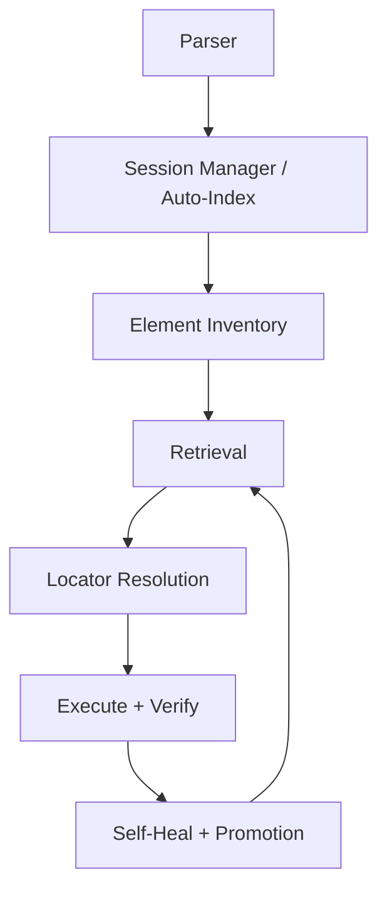
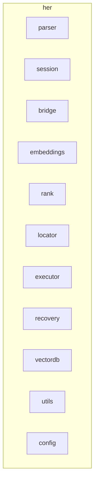

> Archived during canonicalization; superseded by docs/ARCHITECTURE.md (2025-08-30).
# Diagrams

The following diagrams illustrate the flow of data through the Hybrid++ pipeline and the interactions between major components.  You can generate these diagrams yourself using tools such as [Graphviz](https://graphviz.org) or [PlantUML](https://plantuml.com).

## Pipeline Diagram

This diagram shows the sequence of stages in the Hybrid++ pipeline:

The dashed arrow from **Self‑Heal + Promotion** back to **Retrieval** indicates that when an action fails the system tries alternative locators and refreshes the snapshot.

## Module Structure

This diagram outlines the high‑level package structure.  Each box corresponds to a module or subpackage in ``src/her``.

The test suite (`tests/`) exercises the public API provided by `her.cli_api` and verifies behaviours such as auto‑indexing and configuration overrides.
