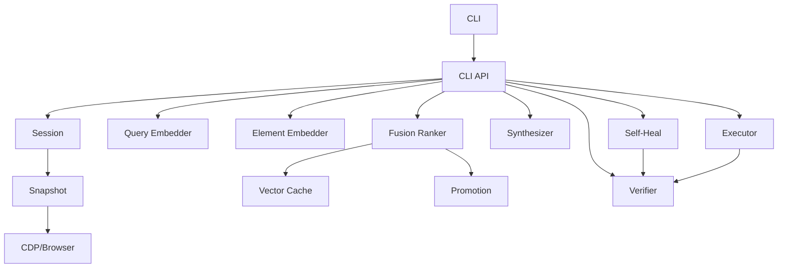

# HER Components Matrix

## Framework Architecture

The HER (Hybrid Element Retriever) framework consists of multiple interconnected components that work together to provide robust, non-rule-based element location.

## Core Components

### 1. Snapshot (`src/her/bridge/snapshot.py`)

**Purpose**: Captures DOM and accessibility tree via Chrome DevTools Protocol (CDP)

**Inputs**:
- `Page` object from Playwright
- `pierce_shadow` flag for shadow DOM traversal

**Outputs**:
- `SnapshotResult` containing:
  - `frames[]`: Array of Frame objects with frame_id, url, dom_hash, dom_nodes, ax_nodes
  - `total_nodes`: Total count of DOM nodes
  - `timestamp`: Capture timestamp
  - `viewport`: Viewport dimensions

**Key Methods**:
- `capture()`: Main snapshot capture using CDP `DOM.getFlattenedDocument` and `Accessibility.getFullAXTree`
- `_process_frames()`: Processes raw CDP data into structured Frame objects
- `_build_xpath()`, `_build_css_path()`: Generates paths for elements

**Dependencies**: playwright, CDP session

**Contracts**: 
- Always returns complete snapshot even if some nodes fail
- Handles shadow DOM when pierce=true
- Generates unique dom_hash for change detection

---

### 2. Session (`src/her/executor/session.py`)

**Purpose**: Manages browser session with SPA route detection and DOM delta tracking

**Inputs**:
- `Page` object
- `auto_detect_spa` flag

**Outputs**:
- Route change events
- DOM delta percentages
- Reindex triggers

**Key Methods**:
- `initialize()`: Sets up route listeners
- `take_snapshot()`: Cached snapshot management
- `reindex_if_needed()`: Triggers reindex on 30% DOM change
- `wait_for_stable_dom()`: Waits for DOM stabilization

**SPA Detection**:
- Intercepts `pushState`, `replaceState`, `popstate`, `hashchange`
- Calculates DOM delta on route changes
- Threshold: 30% change triggers reindex

**Dependencies**: Snapshot, asyncio

**Contracts**:
- Maintains snapshot cache (max 10 entries)
- Auto-detects SPA navigation
- Provides reindex callback mechanism

---

### 3. Embeddings Resolver (`src/her/embeddings/_resolve.py`)

**Purpose**: Resolves model paths with fallback order

**Search Order**:
1. `HER_MODELS_DIR` environment variable
2. Packaged models in `src/her/models/`
3. User home `~/.her/models/`

**Outputs**:
- Model file paths
- Model metadata from MODEL_INFO.json

**Dependencies**: pathlib, json

**Contracts**:
- Always returns a valid path or None
- Creates user directory if needed
- Loads MODEL_INFO.json for metadata

---

### 4. Query Embedder (`src/her/embeddings/query_embedder.py`)

**Purpose**: Embeds user queries using E5-small ONNX model

**Inputs**:
- Query text string

**Outputs**:
- 384-dimensional embedding vector (E5-small)
- Normalized to unit vector

**Fallback**:
- Deterministic hash-based embedding if ONNX unavailable
- SHA256 hash + token structure

**Dependencies**: onnxruntime, transformers, numpy

**Contracts**:
- Always returns embedding (model or fallback)
- Consistent dimension (384)
- Deterministic fallback for reproducibility

---

### 5. Element Embedder (`src/her/embeddings/element_embedder.py`)

**Purpose**: Embeds DOM elements using MarkupLM-base ONNX model

**Inputs**:
- `DOMNode` objects
- Previous nodes for delta embedding

**Outputs**:
- 768-dimensional embedding vectors (MarkupLM)
- `ElementEmbedding` objects with metadata

**Caching**:
- In-memory cache (max 10,000 entries)
- Cache key: backend_node_id + content hash

**Delta Embedding**:
- `embed_delta()`: Only embeds changed elements
- Returns reuse count for efficiency

**Dependencies**: onnxruntime, transformers, numpy

**Contracts**:
- Caches embeddings for performance
- Supports partial re-embedding
- Fallback to hash-based embedding

---

### 6. Vector Cache (`src/her/vectordb/sqlite_cache.py`)

**Purpose**: SQLite-based vector cache with LRU eviction

**Storage**: `.cache/embeddings/vectors.db`

**Features**:
- LRU eviction (max 100,000 entries)
- Memory cache layer (1,000 items)
- Batch operations
- Statistics tracking

**Key Methods**:
- `batch_get()`, `batch_put()`: Efficient batch operations
- `get_stats()`: Cache hit rate, evictions

**Dependencies**: aiosqlite, numpy

**Contracts**:
- Thread-safe async operations
- Automatic cleanup at 100k entries
- Persistent across sessions

---

### 7. Ranking/Fusion (`src/her/rank/fusion.py`)

**Purpose**: Combines semantic and heuristic scores with fusion

**Weights**:
- α=1.0: Semantic similarity (highest, ensures non-rule-based)
- β=0.5: Robust CSS heuristics
- γ=0.2: Promotion from history

**Scoring Components**:

1. **Semantic Score**:
   - Cosine similarity between query and element embeddings
   - Range: [0, 1]
   - Primary ranking factor (α=1.0)

2. **Heuristic Score**:
   - Penalizes: hash-like IDs/classes, deep nesting, hidden elements
   - Rewards: semantic HTML tags, ARIA labels, visible/clickable
   - Range: [0, 1]
   
3. **Promotion Score**:
   - Historical success rate
   - From promotion.db
   - Range: [0, 1]

**Final Score**: `(α*semantic + β*heuristic + γ*promotion) / (α + β + γ)`

**Dependencies**: scipy, numpy

**Contracts**:
- Semantic score MUST materially affect ranking
- No rule-only decisions
- Normalized output [0, 1]

---

### 8. Locator Synthesis (`src/her/locator/synthesize.py`)

**Purpose**: Generates robust selectors from DOM nodes

**Priority**:
1. CSS selectors (stable, fast)
2. Contextual XPath (when CSS insufficient)
3. Text/ARIA fallbacks

**Features**:
- Avoids hash-like IDs/classes
- Generates alternatives
- Context-aware uniqueness checking

**Outputs**:
- `SynthesizedLocator` with:
  - `selector`: Primary selector
  - `strategy`: 'css', 'xpath', 'text', 'aria'
  - `confidence`: [0, 1]
  - `alternatives[]`: Fallback selectors

**Dependencies**: re, DOM context

**Contracts**:
- Always returns a selector
- Prioritizes robust over fragile
- Provides alternatives

---

### 9. Locator Verification (`src/her/locator/verify.py`)

**Purpose**: Validates selectors against live page

**Checks**:
- Uniqueness (count == 1)
- Visibility
- Occlusion (elementFromPoint)
- Disabled state
- Frame context

**Outputs**:
- `VerificationResult` with:
  - `ok`: Overall success
  - `unique`, `visible`, `occluded`, `disabled`: Individual checks
  - `used_selector`: Final selector used
  - `explanation`: Human-readable status

**Dependencies**: playwright

**Contracts**:
- Per-frame uniqueness validation
- Handles all selector strategies
- Returns detailed failure reasons

---

### 10. Action Executor (`src/her/executor/actions.py`)

**Purpose**: Executes actions with safety checks

**Actions**: click, type, select, check, hover, focus, clear, upload

**Safety Features**:
- `wait_for_idle()`: Waits for readyState + network idle
- Auto-close overlays (cookie banners, modals)
- Spinner detection and wait
- Scroll into view
- Post-action verification

**Outputs**:
- `ActionResult` with:
  - `waits`: before/after timings
  - `post_action`: State changes (URL, DOM, values)
  - `duration_ms`: Total execution time

**Dependencies**: playwright, asyncio

**Contracts**:
- Always waits for stability
- Handles overlays automatically
- Captures post-action state

---

### 11. Self-Heal (`src/her/recovery/self_heal.py`)

**Purpose**: Recovers from selector failures

**Methods**:
1. Historical lookup
2. Alternative synthesis
3. Selector relaxation
4. Partial matching

**Features**:
- Maintains healing history
- Export/import mappings
- Multiple fallback strategies

**Dependencies**: Synthesizer, Verifier

**Contracts**:
- Attempts multiple strategies
- Persists successful healings
- Returns confidence score

---

### 12. Promotion (`src/her/recovery/promotion.py`)

**Purpose**: Tracks and promotes successful selectors

**Storage**: `.cache/promotion.db`

**Features**:
- Success/failure tracking
- Confidence calculation
- URL pattern matching
- Memory cache for high-confidence entries

**Integration**:
- Provides γ scores to fusion ranker
- Influences future rankings

**Dependencies**: aiosqlite

**Contracts**:
- Persistent storage
- Pattern-based matching
- Confidence decay over failures

---

### 13. CLI API (`src/her/cli_api.py`)

**Purpose**: High-level Python API

**Main Methods**:
- `query(phrase, url)`: Natural language element location
- `act(step, url)`: Execute action steps
- `get_stats()`: Framework statistics

**Output Format**:
- Strict JSON with all required fields
- Includes waits, frame info, post-action state
- No empty required fields

**Dependencies**: All core components

**Contracts**:
- Manages component lifecycle
- Coordinates pipeline execution
- Returns structured results

---

### 14. CLI (`src/her/cli.py`)

**Purpose**: Command-line interface

**Commands**:
- `query`: Find elements
- `act`: Execute actions
- `stats`: Show statistics
- `version`: Component status

**Output Formats**:
- JSON (strict, parseable)
- Table (human-readable)

**Dependencies**: click, rich, cli_api

**Contracts**:
- User-friendly output
- Error handling
- Progress indication

---

## Component Interactions



## Risk Analysis

### Import Cycles
- **Risk**: cli_api imports all components
- **Mitigation**: One-way dependencies, no back-references

### Performance Bottlenecks
- **Risk**: Element embedding for large DOMs
- **Mitigation**: Delta embedding, caching, batch operations

### Model Dependencies
- **Risk**: ONNX models not available
- **Mitigation**: Deterministic hash fallbacks

### SPA Detection
- **Risk**: Missing route changes
- **Mitigation**: Multiple detection methods, DOM delta threshold

## Contracts Summary

1. **Semantic-First Ranking**: α ≥ max(β, γ) ensures non-rule-based
2. **Strict JSON Output**: No empty required fields
3. **Fallback Chains**: Every component has fallbacks
4. **Cache Management**: Automatic eviction and cleanup
5. **State Persistence**: Promotion and healing history survive restarts
6. **Frame Support**: All operations handle nested frames
7. **Error Recovery**: Self-heal and alternative selectors
8. **Performance**: Cold vs warm runs with caching

## File Organization

```
src/her/
├── __init__.py           # Package initialization
├── cli_api.py           # Main API
├── cli.py               # CLI interface
├── bridge/
│   └── snapshot.py      # CDP snapshot
├── executor/
│   ├── session.py       # Session management
│   └── actions.py       # Action execution
├── embeddings/
│   ├── _resolve.py      # Model resolver
│   ├── query_embedder.py
│   └── element_embedder.py
├── vectordb/
│   └── sqlite_cache.py  # Vector caching
├── rank/
│   └── fusion.py        # Fusion ranking
├── locator/
│   ├── synthesize.py    # Selector generation
│   └── verify.py        # Selector verification
├── recovery/
│   ├── self_heal.py     # Self-healing
│   └── promotion.py     # Promotion system
└── models/              # ONNX models (after install)
    ├── MODEL_INFO.json
    ├── e5_small.onnx
    └── markuplm_base.onnx
```